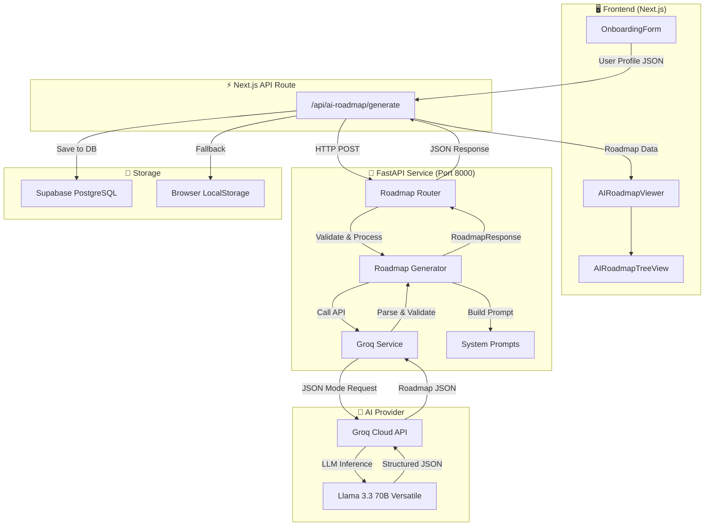
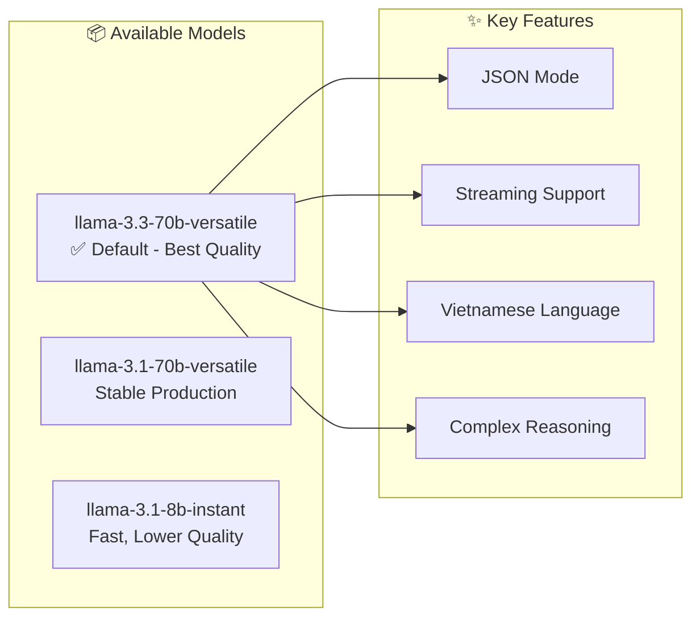
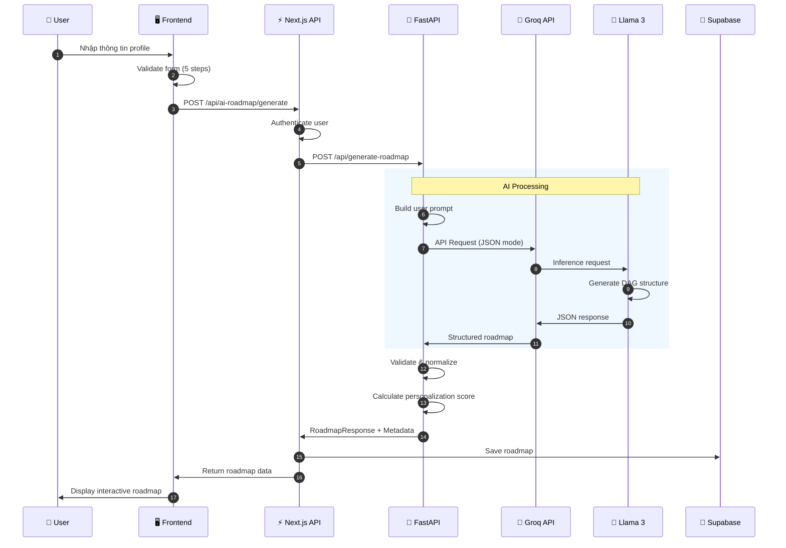
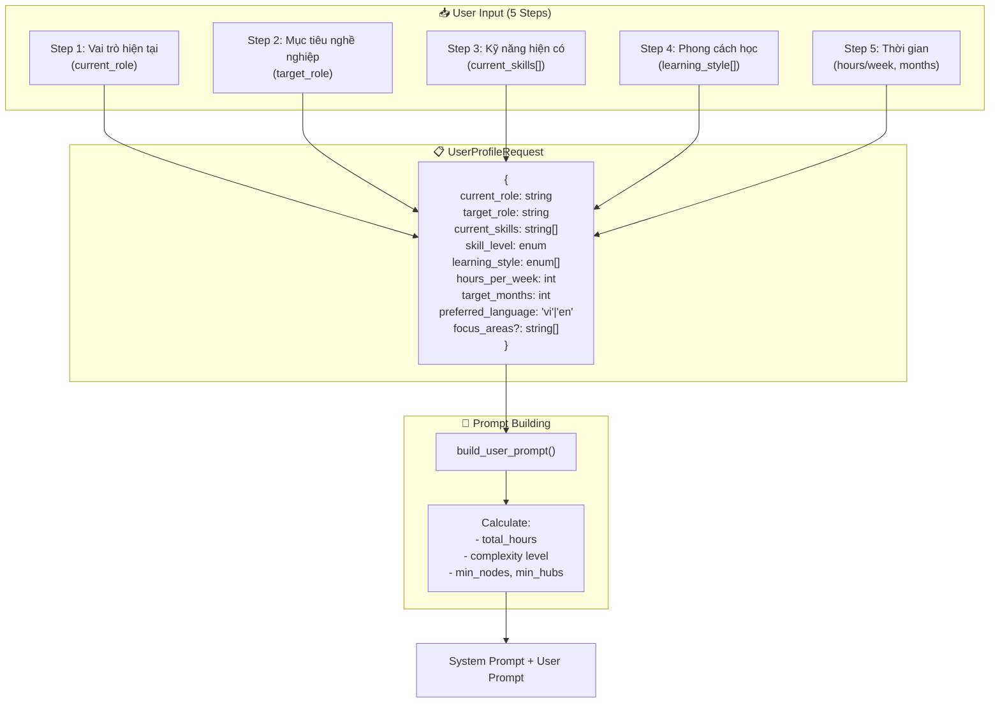
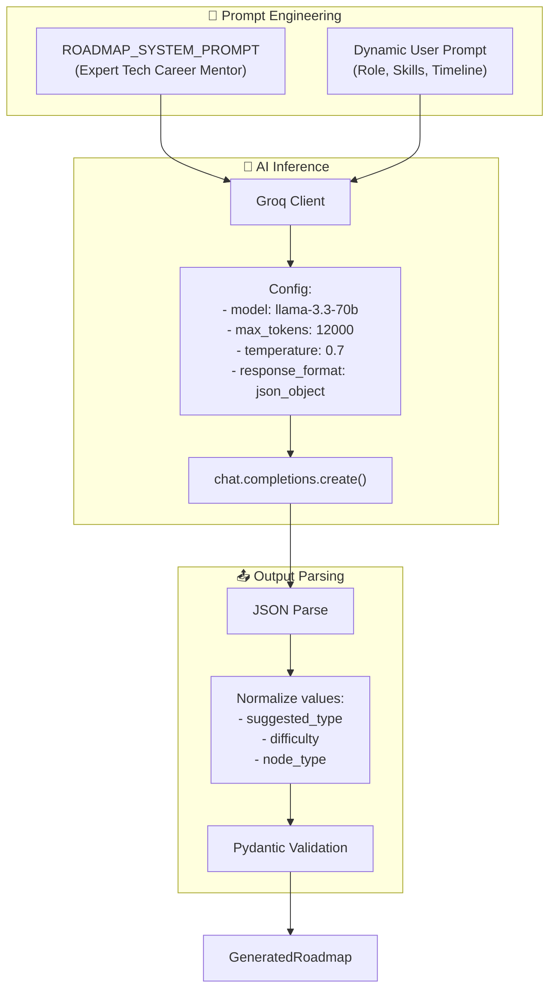
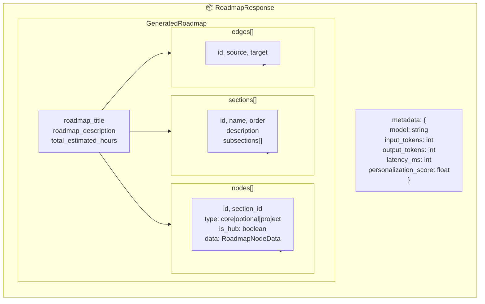
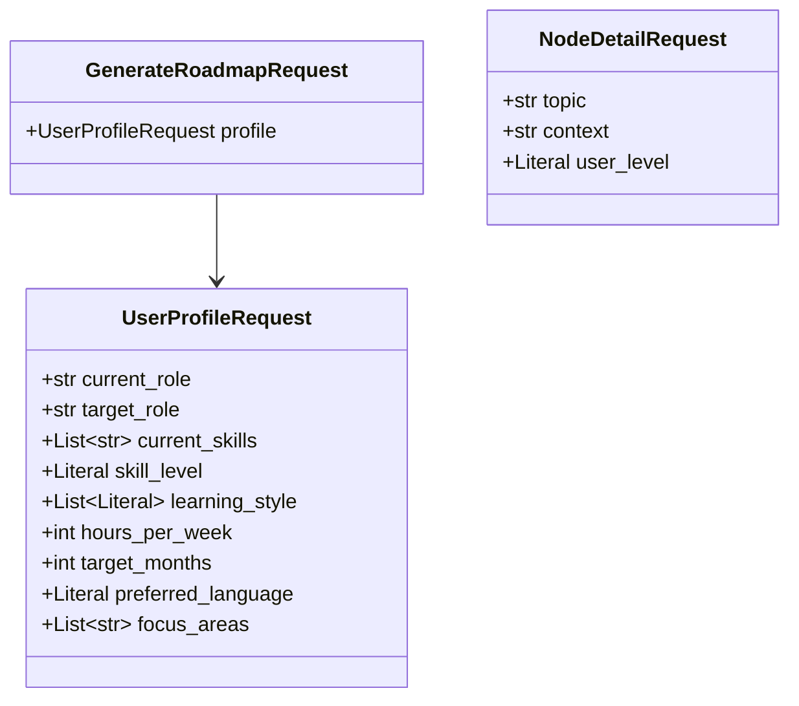
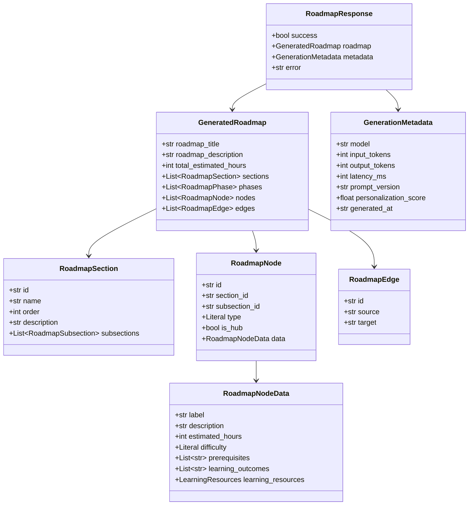
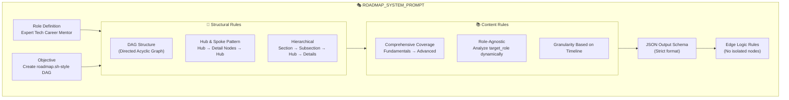
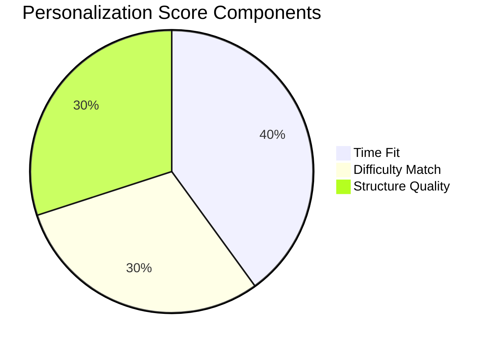

# 🤖 AI Roadmap Generator Service

> **Dịch vụ FastAPI tạo lộ trình học tập cá nhân hóa sử dụng AI (Groq + Llama 3)**

Đây là phần backend AI của nền tảng **AIoT Learning Platform**, sử dụng mô hình ngôn ngữ lớn (LLM) **Llama 3.3 70B** thông qua **Groq API** để sinh ra lộ trình học tập dạng đồ thị có hướng (DAG) theo phong cách [roadmap.sh](https://roadmap.sh).

---

## 📋 Mục lục

1. [Tổng quan kiến trúc](#-tổng-quan-kiến-trúc)
2. [Mô hình AI sử dụng](#-mô-hình-ai-sử-dụng)
3. [Luồng xử lý dữ liệu](#-luồng-xử-lý-dữ-liệu)
4. [Cấu trúc thư mục](#-cấu-trúc-thư-mục)
5. [API Endpoints](#-api-endpoints)
6. [Data Models](#-data-models)
7. [Prompt Engineering](#-prompt-engineering)
8. [Triển khai & Cấu hình](#-triển-khai--cấu-hình)
9. [Metrics & Đánh giá](#-metrics--đánh-giá)

---

## 🏗 Tổng quan kiến trúc

### Sơ đồ hệ thống tổng thể



### Tech Stack

| Layer | Technology | Mô tả |
|-------|------------|-------|
| **AI Provider** | Groq Cloud | API inference tốc độ cao cho LLM |
| **LLM Model** | Llama 3.3 70B Versatile | Model mới nhất, hỗ trợ tiếng Việt tốt |
| **Backend** | FastAPI | Python web framework hiệu suất cao |
| **Validation** | Pydantic v2 | Data validation và serialization |
| **Streaming** | SSE-Starlette | Server-Sent Events cho streaming |
| **Frontend** | Next.js 14 + React Flow | Hiển thị roadmap dạng đồ thị |
| **Database** | Supabase (PostgreSQL) | Lưu trữ roadmap và tiến độ |

---

## 🧠 Mô hình AI sử dụng

### Groq + Llama 3

Service sử dụng **Groq API** để truy cập các mô hình Llama 3 với tốc độ inference cực nhanh (10-100x faster than traditional GPU inference).



### So sánh các model

| Model | Speed | Quality | Vietnamese | JSON Stability | Use Case |
|-------|-------|---------|------------|----------------|----------|
| `llama-3.3-70b-versatile` | Medium | **Best** | **Excellent** | **Excellent** | Production (Default) |
| `llama-3.1-70b-versatile` | Medium | High | Good | Good | Backup/Alternative |
| `llama-3.1-8b-instant` | **Fast** | Medium | Fair | Fair | Testing/Development |

### Tại sao chọn Groq + Llama 3?

1. **Tốc độ**: Groq's LPU (Language Processing Unit) cho inference 10-100x nhanh hơn GPU
2. **Chi phí**: Free tier với 30 requests/phút đủ cho development
3. **Tiếng Việt**: Llama 3.3 70B hỗ trợ tiếng Việt tốt hơn các phiên bản trước
4. **JSON Mode**: Native JSON mode đảm bảo output luôn valid JSON

---

## 🔄 Luồng xử lý dữ liệu

### 1. Flow tổng quan



### 2. Chi tiết xử lý đầu vào (Input Processing)



### 3. Chi tiết xử lý AI



### 4. Cấu trúc dữ liệu đầu ra (Output Structure)



---

## 📁 Cấu trúc thư mục

```
ai-service/
├── 📄 main.py                 # FastAPI application entry point
├── 📄 requirements.txt        # Python dependencies
├── 📄 Dockerfile              # Container configuration
├── 📄 .env                    # Environment variables
├── 📄 start_service.ps1       # PowerShell startup script
│
└── 📁 app/
    ├── 📄 __init__.py
    ├── 📄 config.py           # Settings & model configuration
    │
    ├── 📁 models/             # Pydantic data models
    │   ├── 📄 __init__.py     # Export all models
    │   ├── 📄 request.py      # UserProfileRequest, GenerateRoadmapRequest
    │   └── 📄 response.py     # RoadmapResponse, GeneratedRoadmap, etc.
    │
    ├── 📁 services/           # Business logic
    │   ├── 📄 __init__.py
    │   ├── 📄 groq_service.py        # Groq API communication
    │   └── 📄 roadmap_generator.py   # Main generation logic
    │
    ├── 📁 prompts/            # AI prompt templates
    │   ├── 📄 __init__.py
    │   └── 📄 system_prompts.py      # ROADMAP_SYSTEM_PROMPT + builder
    │
    └── 📁 routers/            # API route handlers
        ├── 📄 __init__.py
        └── 📄 roadmap.py      # /api/generate-roadmap endpoints
```

---

## 🔌 API Endpoints

### Base URL

```
Development: http://localhost:8000
Production:  https://your-domain.com/api
```

### Endpoints

| Method | Endpoint | Mô tả |
|--------|----------|-------|
| `GET` | `/` | Health check cơ bản |
| `GET` | `/health` | Health check chi tiết với API status |
| `POST` | `/api/generate-roadmap` | Tạo roadmap (non-streaming) |
| `POST` | `/api/generate-roadmap/stream` | Tạo roadmap với SSE streaming |
| `POST` | `/api/validate-profile` | Validate profile trước khi generate |
| `POST` | `/api/node-detail` | Lấy chi tiết + resources cho một node |

---

### POST /api/generate-roadmap

Tạo lộ trình học tập cá nhân hóa.

**Request Body:**

```json
{
  "profile": {
    "current_role": "Sinh viên năm 3",
    "target_role": "Frontend Developer",
    "current_skills": ["HTML/CSS", "JavaScript cơ bản"],
    "skill_level": "beginner",
    "learning_style": ["video", "project"],
    "hours_per_week": 15,
    "target_months": 6,
    "preferred_language": "vi",
    "focus_areas": ["React", "TypeScript"]
  }
}
```

**Response (Success):**

```json
{
  "success": true,
  "roadmap": {
    "roadmap_title": "Lộ trình Frontend Developer",
    "roadmap_description": "Lộ trình học tập từ beginner đến Frontend Developer...",
    "total_estimated_hours": 360,
    "sections": [
      {
        "id": "sec-1",
        "name": "Nền tảng Web",
        "order": 1,
        "subsections": [...]
      }
    ],
    "nodes": [
      {
        "id": "node-html-basics",
        "section_id": "sec-1",
        "type": "core",
        "is_hub": true,
        "data": {
          "label": "HTML Basics",
          "description": "Học các thẻ HTML cơ bản...",
          "estimated_hours": 10,
          "difficulty": "beginner",
          "learning_resources": {
            "keywords": ["HTML5", "semantic HTML"],
            "suggested_type": "video"
          }
        }
      }
    ],
    "edges": [
      {"id": "e1", "source": "node-html-basics", "target": "node-css-basics"}
    ]
  },
  "metadata": {
    "model": "llama-3.3-70b-versatile",
    "input_tokens": 850,
    "output_tokens": 3200,
    "latency_ms": 12500,
    "prompt_version": "2.0.0",
    "personalization_score": 0.85,
    "generated_at": "2025-02-02T15:30:00Z"
  }
}
```

---

### POST /api/generate-roadmap/stream

Tương tự `/generate-roadmap` nhưng sử dụng **Server-Sent Events (SSE)** để streaming response về từng chunk.

**Events:**

| Event | Data | Mô tả |
|-------|------|-------|
| `chunk` | `{"content": "..."}` | Một phần của JSON response |
| `complete` | `{"content": "full_json"}` | JSON hoàn chỉnh |
| `error` | `{"error": "message"}` | Lỗi xảy ra |

---

### POST /api/validate-profile

Validate user profile và estimate output trước khi generate.

**Response:**

```json
{
  "valid": true,
  "total_available_hours": 360,
  "estimated_nodes": "40-60",
  "profile_summary": {
    "from": "Sinh viên năm 3",
    "to": "Frontend Developer",
    "duration": "6 months",
    "intensity": "15 hours/week"
  }
}
```

---

### POST /api/node-detail

Lấy thông tin chi tiết và tài nguyên học tập cho một topic cụ thể.

**Request:**

```json
{
  "topic": "React Hooks",
  "context": "Frontend Development",
  "user_level": "intermediate"
}
```

**Response:**

```json
{
  "description": "React Hooks là một phần quan trọng...",
  "related_concepts": ["useState", "useEffect", "Custom Hooks"],
  "free_resources": [
    {"type": "article", "title": "...", "url": "...", "source": "MDN"},
    {"type": "video", "title": "...", "url": "...", "source": "YouTube"}
  ],
  "ai_tutor_content": "## React Hooks\n\n...",
  "premium_resources": [...]
}
```

---

## 📊 Data Models

### Request Models



### Response Models



---

## 🎯 Prompt Engineering

### System Prompt Strategy

Service sử dụng kỹ thuật **Prompt Engineering** nâng cao để đảm bảo AI tạo ra roadmap chất lượng cao và nhất quán.



### Dynamic User Prompt

User prompt được xây dựng động dựa trên profile:

```python
def build_user_prompt(
    current_role: str,
    target_role: str,
    current_skills: List[str],
    skill_level: str,
    learning_style: List[str],
    hours_per_week: int,
    target_months: int,
    preferred_language: str,
    focus_areas: List[str] | None = None,
) -> str:
    # Calculate complexity based on timeline
    total_hours = hours_per_week * target_months * 4
    
    if target_months <= 3:
        complexity = "Compact & Fast-track"
        min_nodes = 40
        min_hubs = 8
    elif target_months <= 6:
        complexity = "Standard Professional Path"
        min_nodes = 80
        min_hubs = 15
    else:
        complexity = "Deep Mastery"
        min_nodes = 120
        min_hubs = 25
```

### Complexity Scaling

| Timeline | Complexity Level | Min Nodes | Min Hubs | Focus |
|----------|-----------------|-----------|----------|-------|
| 1-3 months | Compact & Fast-track | 40 | 8 | MVP Skills |
| 4-6 months | Standard Professional | 80 | 15 | Balanced |
| 7+ months | Deep Mastery | 120 | 25 | Full Ecosystem |

---

## 🚀 Triển khai & Cấu hình

### 1. Cài đặt Development

```bash
# Clone và di chuyển vào thư mục
cd ai-service

# Tạo virtual environment
python -m venv venv

# Activate (Windows)
venv\Scripts\activate

# Activate (Linux/Mac)
source venv/bin/activate

# Cài đặt dependencies
pip install -r requirements.txt
```

### 2. Cấu hình Environment

Tạo file `.env`:

```env
# Groq API (Required)
GROQ_API_KEY=gsk_xxxxxxxxxxxxxxxxxxxxxxxxxxxx
GROQ_MODEL=llama-3.3-70b-versatile
GROQ_MAX_TOKENS=12000
GROQ_TEMPERATURE=0.7

# Supabase (Optional - for direct access)
SUPABASE_URL=https://xxx.supabase.co
SUPABASE_SERVICE_KEY=eyJxxx...

# CORS
CORS_ORIGINS=["http://localhost:3000", "http://127.0.0.1:3000"]

# App Settings
DEBUG=True
LOG_LEVEL=INFO
PROMPT_VERSION=2.0.0
```

> 💡 **Lấy Groq API Key miễn phí**: Đăng ký tại [console.groq.com](https://console.groq.com/)

### 3. Chạy Development Server

```bash
# Cách 1: Trực tiếp
python main.py

# Cách 2: Uvicorn với hot reload
uvicorn main:app --reload --port 8000

# Cách 3: PowerShell script (Windows)
.\start_service.ps1
```

### 4. Docker Deployment

```bash
# Build image
docker build -t ai-roadmap-service .

# Run container
docker run -p 8000:8000 --env-file .env ai-roadmap-service

# Or with docker-compose
docker compose up -d
```

### 5. Cấu hình Frontend

Trong Next.js app, thêm vào `.env.local`:

```env
FASTAPI_BASE_URL=http://localhost:8000
```

---

## 📈 Metrics & Đánh giá

### Performance Targets

| Metric | Target | Actual (Avg) | Status |
|--------|--------|--------------|--------|
| Latency (Full) | < 15s | 10-12s | ✅ |
| Latency (Stream First Token) | < 5s | 2-3s | ✅ |
| Input Tokens | 500-800 | ~750 | ✅ |
| Output Tokens | 2000-4000 | ~3200 | ✅ |
| Cost per Generation | ~$0.01-0.02 | Free (Groq) | ✅ |
| Personalization Score | > 0.8 | 0.82-0.88 | ✅ |

### Personalization Score Calculation

Score được tính dựa trên 3 yếu tố:



1. **Time Fit (40%)**: Tổng giờ học phù hợp với thời gian available của user
2. **Difficulty Match (30%)**: Độ khó ban đầu phù hợp với skill level
3. **Structure Quality (30%)**: Số sections, connectivity, node type variety

### Error Handling

| Error Type | HTTP Code | Handling |
|------------|-----------|----------|
| Rate Limit | 429 | Retry với exponential backoff |
| Invalid API Key | 401 | Clear error message |
| Connection Error | 503 | Retry hoặc fallback |
| JSON Parse Error | 400 | Log và retry với stricter prompt |
| Unexpected Error | 500 | Log full traceback |

---

## 🔗 Tích hợp với Frontend

### Frontend Components

| Component | File | Mô tả |
|-----------|------|-------|
| `OnboardingForm` | `src/components/AIRoadmap/OnboardingForm.tsx` | Form 5 bước thu thập profile |
| `AIRoadmapViewer` | `src/components/AIRoadmap/AIRoadmapViewer.tsx` | Hiển thị roadmap với React Flow |
| `AIRoadmapTreeView` | `src/components/AIRoadmap/AIRoadmapTreeView.tsx` | Hiển thị dạng tree view |
| `AINodeDetailDrawer` | `src/components/AIRoadmap/AINodeDetailDrawer.tsx` | Chi tiết node với resources |

### API Route Integration

```typescript
// src/app/api/ai-roadmap/generate/route.ts
const response = await fetch(`${FASTAPI_BASE_URL}/api/generate-roadmap`, {
  method: 'POST',
  headers: { 'Content-Type': 'application/json' },
  body: JSON.stringify({ profile }),
});
```

---

## 📝 License

MIT License - Xem file [LICENSE](../LICENSE) để biết thêm chi tiết.

---

## 👥 Contributors

- **AIoT Learning Platform Team** - Development & Maintenance

---

> 📧 **Support**: Nếu có vấn đề, vui lòng tạo issue hoặc liên hệ team.
