# Hướng Dẫn Thuyết Trình Và Demo Các Cơ Chế Bảo Mật

> Tài liệu này dùng để ôn tập, ghi nhớ và thực hiện demo các cơ chế bảo mật của hệ thống AIoT Learning Platform trong buổi báo cáo đồ án tốt nghiệp.
>
> Cập nhật: 2026-05-14

---

## 1. Mục Tiêu Tài Liệu

Tài liệu này tập trung vào 10 kịch bản bảo mật đã chuẩn bị:

| STT | Kịch bản | Mục tiêu demo |
|---:|---|---|
| 1 | Security Headers | Chứng minh response có header bảo mật |
| 2 | JWT HTTP-only Cookie | Chứng minh token đăng nhập không bị JavaScript đọc trực tiếp |
| 3 | CSRF Protection | Chứng minh request thay đổi dữ liệu bị chặn nếu thiếu `X-CSRF-Token` |
| 4 | Route Protection | Chứng minh route cần đăng nhập không cho truy cập khi chưa xác thực |
| 5 | RBAC | Chứng minh tài khoản `student` không truy cập được API admin |
| 6 | Rate Limiting | Chứng minh hệ thống chống spam request đăng nhập |
| 7 | Account Lockout | Chứng minh tài khoản bị khóa tạm thời sau nhiều lần nhập sai |
| 8 | Recovery Keys | Chứng minh có cơ chế khôi phục tài khoản khi đăng ký |
| 9 | bcrypt | Chứng minh mật khẩu không lưu plain text |
| 10 | CORS Whitelist | Chứng minh chỉ origin tin cậy được browser cho phép đọc response |

Tài liệu không chỉ nêu “có cơ chế”, mà giải thích:

- Cơ chế được thiết kế để chống rủi ro nào.
- File/module nào đang triển khai.
- Luồng hoạt động trong hệ thống.
- Cách demo trước hội đồng.
- Kết quả mong đợi khi demo.
- Các điểm cần lưu ý để tránh chọn sai endpoint hoặc hiểu sai kết quả.

---

## 2. Bối Cảnh Kỹ Thuật

Hệ thống là ứng dụng Next.js, dùng API routes trong `src/app/api`, middleware tại `src/middleware.ts`, Supabase làm database, JWT cho session đăng nhập web/mobile, và bcrypt để hash mật khẩu.

Các file bảo mật chính:

| Thành phần | File chính | Vai trò |
|---|---|---|
| Middleware bảo mật | `src/middleware.ts` | Security headers, CORS, CSRF tại middleware, route protection |
| JWT + bcrypt | `src/lib/auth.ts` | Hash password, compare password, sign/verify JWT |
| Cookie auth response | `src/lib/auth-response.ts` | Web không trả JWT trong JSON body; mobile có thể nhận Bearer token |
| CSRF | `src/lib/csrf.ts`, `src/lib/secure-fetch.ts`, `src/lib/csrf-fetch.ts` | Double Submit Cookie và tự gắn `X-CSRF-Token` |
| API auth wrapper | `src/lib/api-middleware.ts` | `withAuth()` kiểm tra rate limit, CSRF, JWT, role |
| Rate limit | `src/lib/rateLimit.ts` | In-memory IP-based limiter |
| Login/register | `src/app/api/auth/login/route.ts`, `src/app/api/auth/register/route.ts` | Login, lockout, cookie, recovery keys |
| Recovery keys | `src/app/api/auth/recovery-key/*` | Tạo, liệt kê, xác minh recovery key |
| RBAC admin | `src/app/api/admin/profile-reviews/route.ts`, `src/app/api/admin/users/[userId]/roles/route.ts` | Chặn user không phải admin |
| Client auth | `src/contexts/AuthContext.tsx` | Gọi CSRF, kiểm tra session, login/register/logout |

---

## 3. Sơ Đồ Tổng Thể Bảo Mật

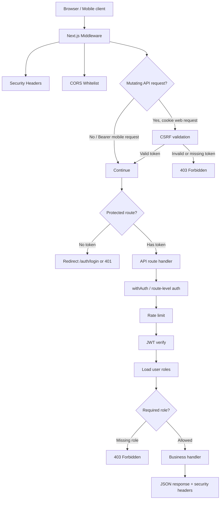

Thông điệp trình bày:

> Hệ thống không phụ thuộc vào một lớp bảo mật duy nhất. Request đi qua nhiều lớp: header an toàn, CORS, CSRF, route protection, JWT, rate limit, role authorization và cuối cùng mới đến logic nghiệp vụ.

---

## 4. Chuẩn Bị Trước Khi Demo

### 4.1. Môi trường

Chạy ứng dụng:

```powershell
pnpm dev
```

Mặc định demo tại:

```powershell
$BASE = "http://localhost:3000"
```

Chuẩn bị ít nhất 2 tài khoản:

| Tài khoản | Vai trò | Dùng cho |
|---|---|---|
| `student_demo@example.com` | `student` | Route protection, RBAC fail, account lockout |
| `admin_demo@example.com` | `admin` | RBAC pass |

Không dùng tài khoản admin thật để demo account lockout.

### 4.2. Công cụ demo

- Browser DevTools: tab `Network`, `Application`, `Console`.
- PowerShell: dùng `curl.exe` hoặc `Invoke-WebRequest`.
- Supabase dashboard hoặc SQL editor: chỉ dùng để quan sát hash/metadata khi cần.
- Incognito window: dùng để demo trạng thái chưa đăng nhập.

### 4.3. Lưu ý quan trọng trước demo

Một số endpoint có comment hoặc tên là admin nhưng chưa phải endpoint tốt để demo RBAC:

| Endpoint | Tình trạng hiện tại | Khuyến nghị demo |
|---|---|---|
| `GET /api/admin/profile-reviews` | Có kiểm tra JWT + `roles.includes("admin")` | Dùng để demo RBAC |
| `PUT /api/admin/users/{userId}/roles` | Có kiểm tra JWT + `roles.includes("admin")` | Dùng để demo RBAC nâng cao |
| `GET /api/admin/stats` | Hiện chưa tự kiểm tra role trong route | Không dùng làm bằng chứng RBAC |
| `GET /api/admin/courses-full` | Comment nói admin nhưng route chưa kiểm tra role | Không dùng làm bằng chứng RBAC |
| `POST /api/admin/sync-stats` | Hiện chưa tự kiểm tra role trong route | Không dùng làm bằng chứng RBAC |

Với CSRF, nên demo bằng endpoint có `withAuth()` như:

```text
PUT /api/learning/goals/me
```

Không nên demo CSRF bằng login/register vì các endpoint này được miễn CSRF để người dùng chưa có session vẫn đăng nhập/đăng ký được.

---

## 5. Kịch Bản 1 - Security Headers

### 5.1. Mục tiêu

Chứng minh mọi response page/API đi qua middleware đều được gắn các header bảo mật để giảm rủi ro:

- Clickjacking.
- MIME sniffing.
- XSS legacy browser.
- Rò rỉ referrer.
- Lạm dụng quyền camera/microphone/geolocation.
- Tải script/image/media từ nguồn không tin cậy.

### 5.2. Implementation

File chính: `src/middleware.ts`

Hàm chính:

- `setSecurityHeaders(response, pathname)`
- `getPermissionsPolicy(pathname)`

Các header đang set:

| Header | Giá trị/ý nghĩa |
|---|---|
| `X-Frame-Options: DENY` | Không cho nhúng trang vào iframe, chống clickjacking |
| `X-Content-Type-Options: nosniff` | Không cho browser đoán MIME type |
| `X-XSS-Protection: 1; mode=block` | Bật bộ lọc XSS cũ trên legacy browser |
| `Strict-Transport-Security` | Bắt browser dùng HTTPS trong production |
| `Referrer-Policy: strict-origin-when-cross-origin` | Giảm lộ URL/referrer khi cross-origin |
| `Permissions-Policy` | Chặn camera/mic/location mặc định |
| `Content-Security-Policy` | Whitelist nguồn tài nguyên |

Điểm hay để nói:

- `Permissions-Policy` mặc định chặn camera, nhưng route `/tools/face-touch-alert` được phép `camera=(self)` vì đây là tool cần camera.
- CSP không phải “chặn mọi thứ tuyệt đối”; CSP đang cân bằng giữa bảo mật và nhu cầu Next.js/dev tooling, Cloudinary, YouTube, Supabase.

### 5.3. Sơ đồ hoạt động

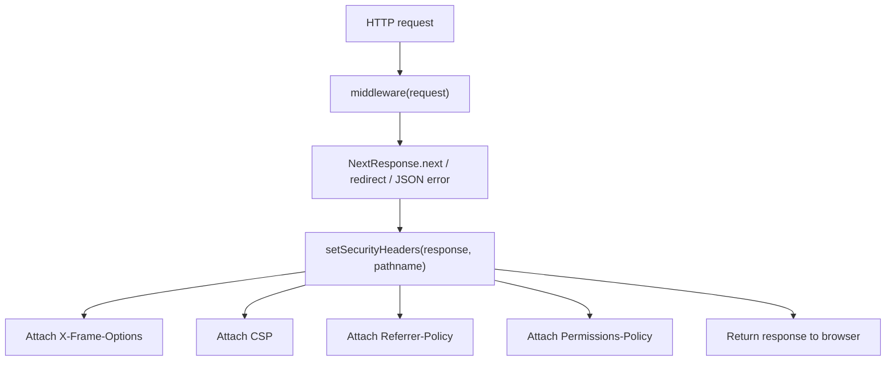

### 5.4. Demo bằng Browser DevTools

1. Mở trang:

```text
http://localhost:3000/
```

2. Mở DevTools.
3. Vào tab `Network`.
4. Reload trang.
5. Chọn request document đầu tiên.
6. Mở `Headers` -> `Response Headers`.
7. Chỉ ra các header:

```text
Content-Security-Policy
X-Frame-Options
X-Content-Type-Options
Referrer-Policy
Permissions-Policy
Strict-Transport-Security
```

### 5.5. Demo bằng PowerShell

```powershell
$BASE = "http://localhost:3000"
curl.exe -I "$BASE/"
```

Kết quả mong đợi: output có các dòng header bảo mật.

### 5.6. Lời trình bày ngắn

> Đây là lớp bảo vệ đầu tiên ở middleware. Dù request đi vào page hay API, response đều được gắn security headers. Ví dụ `X-Frame-Options: DENY` chống clickjacking, `nosniff` chống MIME sniffing, `Permissions-Policy` chặn quyền phần cứng không cần thiết, và CSP giới hạn nguồn script/image/media.

---

## 6. Kịch Bản 2 - JWT HTTP-only Cookie

### 6.1. Mục tiêu

Chứng minh token đăng nhập không bị JavaScript đọc trực tiếp, từ đó giảm rủi ro token bị đánh cắp nếu có XSS.

### 6.2. Implementation

File chính:

- `src/app/api/auth/login/route.ts`
- `src/app/api/auth/register/route.ts`
- `src/lib/auth.ts`
- `src/lib/auth-response.ts`

Cách hoạt động:

1. User gửi email/password.
2. Server kiểm tra password bằng bcrypt.
3. Server tạo JWT bằng `generateToken()`.
4. Web client nhận JWT qua cookie `auth_token` với:

```ts
httpOnly: true
secure: process.env.NODE_ENV === "production"
sameSite: "lax"
maxAge: 7 days
path: "/"
```

5. JSON body cho web không chứa token.
6. Mobile client có thể nhận token trong JSON body nếu request có header `x-client-platform: mobile` hoặc `x-mobile-client: true`.

### 6.3. Sơ đồ hoạt động

```mermaid
sequenceDiagram
    participant U as User
    participant B as Browser
    participant API as Login API
    participant DB as Supabase

    U->>B: Submit email/password
    B->>API: POST /api/auth/login
    API->>DB: Query user by email
    DB-->>API: password_hash + user data
    API->>API: bcrypt.compare(password, hash)
    API->>API: generate JWT
    API-->>B: Set-Cookie auth_token; HttpOnly; SameSite=Lax
    API-->>B: JSON body contains user, not token
    B->>API: Future requests include cookie automatically
```

### 6.4. Demo bằng UI + DevTools

1. Mở trang đăng nhập.
2. Đăng nhập bằng tài khoản student demo.
3. Mở DevTools -> `Application` -> `Cookies` -> `http://localhost:3000`.
4. Chỉ ra cookie:

```text
auth_token
HttpOnly = checked
SameSite = Lax
```

5. Vào tab `Console`, chạy:

```js
document.cookie
```

Kết quả mong đợi:

- Có thể thấy `csrf_token`.
- Không thấy `auth_token`.

Giải thích:

> `csrf_token` cố ý cho JavaScript đọc để gửi header CSRF. `auth_token` là HTTP-only nên browser tự gửi trong request nhưng JavaScript không đọc được.

### 6.5. Demo bằng PowerShell

```powershell
$BASE = "http://localhost:3000"
$StudentEmail = "student_demo@example.com"
$StudentPass = "StudentDemo123"

$session = New-Object Microsoft.PowerShell.Commands.WebRequestSession
$body = @{ email = $StudentEmail; password = $StudentPass } | ConvertTo-Json

$r = Invoke-WebRequest `
  -Uri "$BASE/api/auth/login" `
  -Method POST `
  -Body $body `
  -ContentType "application/json" `
  -WebSession $session

$r.Headers["Set-Cookie"]
$r.Content | ConvertFrom-Json | ConvertTo-Json -Depth 8
```

Kết quả mong đợi:

- `Set-Cookie` có `auth_token=...; HttpOnly; SameSite=Lax`.
- JSON body chỉ có `data.user`, không có `data.token` nếu là web request.

### 6.6. Lời trình bày ngắn

> JWT vẫn tồn tại ở browser nhưng không nằm trong `localStorage` hay response body web. Nó được đặt trong HTTP-only cookie nên JavaScript không đọc được. Nếu xảy ra XSS, attacker khó lấy token trực tiếp hơn so với lưu token ở `localStorage`.

---

## 7. Kịch Bản 3 - CSRF Protection

### 7.1. Mục tiêu

Chứng minh request thay đổi dữ liệu bị chặn nếu thiếu `X-CSRF-Token`.

CSRF là kiểu tấn công trong đó attacker lừa browser của nạn nhân gửi request có cookie đăng nhập đến website thật. Vì cookie tự động được gửi, server có thể nhầm request là hợp lệ nếu không có token chống CSRF.

### 7.2. Implementation

File chính:

- `src/lib/csrf.ts`
- `src/lib/secure-fetch.ts`
- `src/lib/csrf-fetch.ts`
- `src/app/api/auth/csrf/route.ts`
- `src/lib/api-middleware.ts`
- `src/middleware.ts`

Cơ chế đang dùng: Double Submit Cookie.

Luồng:

1. Server tạo `csrf_token`.
2. Server đặt cookie `csrf_token` với `httpOnly: false`, `sameSite: strict`.
3. Client đọc cookie này.
4. Với request `POST`, `PUT`, `PATCH`, `DELETE`, client gửi thêm header:

```text
X-CSRF-Token: <giá trị trong csrf_token cookie>
```

5. Server so sánh cookie token với header token.
6. Nếu thiếu hoặc không khớp -> `403 Forbidden`.

### 7.3. Sơ đồ hoạt động

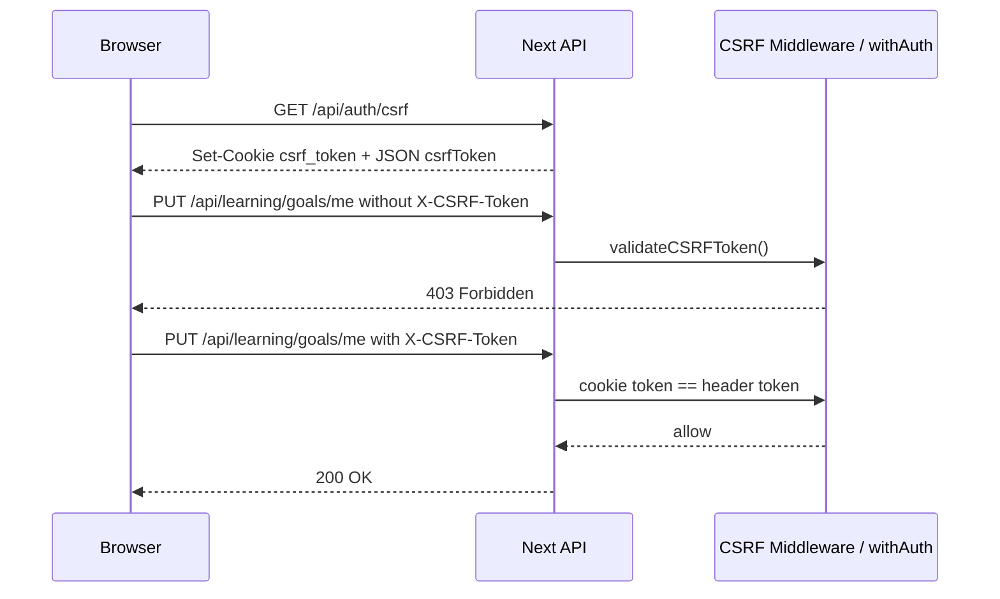

### 7.4. Endpoint khuyến nghị để demo

Dùng:

```text
PUT /api/learning/goals/me
```

Lý do:

- Có `withAuth()`.
- Là request thay đổi dữ liệu.
- Không nằm trong danh sách CSRF exempt.
- Có thể demo bằng Browser Console rõ ràng.

Không dùng login/register vì đây là endpoint khởi tạo phiên đăng nhập nên được miễn CSRF.

### 7.5. Demo bằng Browser Console

Điều kiện: đang đăng nhập bằng tài khoản student.

**Bước 1 - Gửi request thiếu CSRF token**

```js
fetch('/api/learning/goals/me', {
  method: 'PUT',
  credentials: 'include',
  headers: {
    'Content-Type': 'application/json'
  },
  body: JSON.stringify({
    targetRole: 'Frontend Developer',
    skillLevel: 'beginner',
    focusAreas: ['React'],
    currentSkills: ['HTML', 'CSS'],
    hoursPerWeek: 8,
    timelineMonths: 4,
    preferredLanguage: 'vi'
  })
}).then(async (res) => ({
  status: res.status,
  body: await res.json()
})).then(console.log)
```

Kết quả mong đợi:

```text
status: 403
message: CSRF token không hợp lệ...
```

**Bước 2 - Gửi request có CSRF token**

```js
const csrfToken = decodeURIComponent(
  document.cookie.match(/(?:^|;\s*)csrf_token=([^;]*)/)?.[1] || ''
);

fetch('/api/learning/goals/me', {
  method: 'PUT',
  credentials: 'include',
  headers: {
    'Content-Type': 'application/json',
    'X-CSRF-Token': csrfToken
  },
  body: JSON.stringify({
    targetRole: 'Frontend Developer',
    skillLevel: 'beginner',
    focusAreas: ['React'],
    currentSkills: ['HTML', 'CSS'],
    hoursPerWeek: 8,
    timelineMonths: 4,
    preferredLanguage: 'vi'
  })
}).then(async (res) => ({
  status: res.status,
  body: await res.json()
})).then(console.log)
```

Kết quả mong đợi:

```text
status: 200
success: true
```

### 7.6. Lời trình bày ngắn

> Đây là Double Submit Cookie. Cookie đăng nhập có thể tự động được browser gửi, nhưng attacker từ website khác không biết được CSRF token hợp lệ để đặt vào custom header. Vì vậy request thay đổi dữ liệu thiếu `X-CSRF-Token` bị chặn 403 trước khi vào logic nghiệp vụ.

### 7.7. Lưu ý chuyên sâu

- Mobile/Bearer token request được bỏ qua CSRF vì không phụ thuộc cookie tự động của browser.
- CSRF token cố ý không `httpOnly` để JavaScript chính chủ đọc và đặt vào header.
- Auth token thì `httpOnly` vì JavaScript không cần đọc.

---

## 8. Kịch Bản 4 - Route Protection

### 8.1. Mục tiêu

Chứng minh trang/API cần đăng nhập không cho truy cập khi chưa xác thực.

### 8.2. Implementation

File chính:

- `src/middleware.ts`
- `src/lib/server-auth.ts`
- `src/app/api/auth/me/route.ts`
- `src/contexts/AuthContext.tsx`

Middleware kiểm tra protected routes:

```text
/learn
/admin
/settings
/api/lessons
/api/chapters
/api/users/me
```

Cách xử lý:

| Loại request | Chưa đăng nhập | Kết quả |
|---|---|---|
| Page route | Không có `auth_token` | Redirect về `/auth/login` |
| API route | Không có `auth_token` hoặc Bearer token | JSON `401 Unauthorized` |

### 8.3. Sơ đồ hoạt động

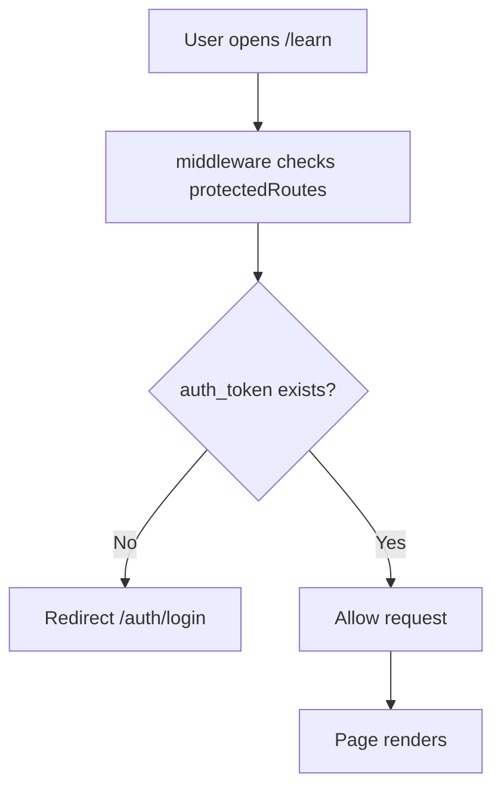

### 8.4. Demo bằng Incognito

1. Mở cửa sổ Incognito để chắc chắn không có cookie.
2. Truy cập:

```text
http://localhost:3000/learn
```

3. Kết quả mong đợi:

```text
Browser bị chuyển về /auth/login
```

4. Đăng nhập.
5. Truy cập lại `/learn`.
6. Kết quả mong đợi: trang được mở.

### 8.5. Demo bằng PowerShell

```powershell
$BASE = "http://localhost:3000"
curl.exe -i "$BASE/learn"
```

Kết quả mong đợi:

- Có status redirect.
- Header `Location` trỏ về `/auth/login`.

Demo API:

```powershell
curl.exe -i "$BASE/api/users/me/courses"
```

Kết quả mong đợi:

```text
HTTP/1.1 401 Unauthorized
```

### 8.6. Lời trình bày ngắn

> Middleware phân biệt public route và protected route. Nếu người dùng chưa có token, page route bị redirect về login, còn API route trả JSON 401. Đây là lớp bảo vệ sớm trước khi vào page hoặc API handler.

---

## 9. Kịch Bản 5 - RBAC: Phân Quyền Theo Vai Trò

### 9.1. Mục tiêu

Chứng minh tài khoản `student` không truy cập được API admin, còn `admin` thì được phép.

RBAC là Role-Based Access Control: quyền truy cập dựa trên vai trò.

### 9.2. Implementation

File chính:

- `src/lib/api-middleware.ts`
- `src/lib/profile-service.ts`
- `src/app/api/admin/profile-reviews/route.ts`
- `src/app/api/admin/users/[userId]/roles/route.ts`
- `src/app/admin/layout.tsx`

Role được lưu trong bảng:

```text
user_roles
```

Luồng kiểm tra:

1. Lấy token từ cookie `auth_token` hoặc `Authorization: Bearer`.
2. Verify JWT.
3. Lấy user hiện tại.
4. Lấy danh sách roles active.
5. Nếu endpoint yêu cầu admin mà user không có `admin` -> trả `403 Forbidden`.

### 9.3. Sơ đồ hoạt động

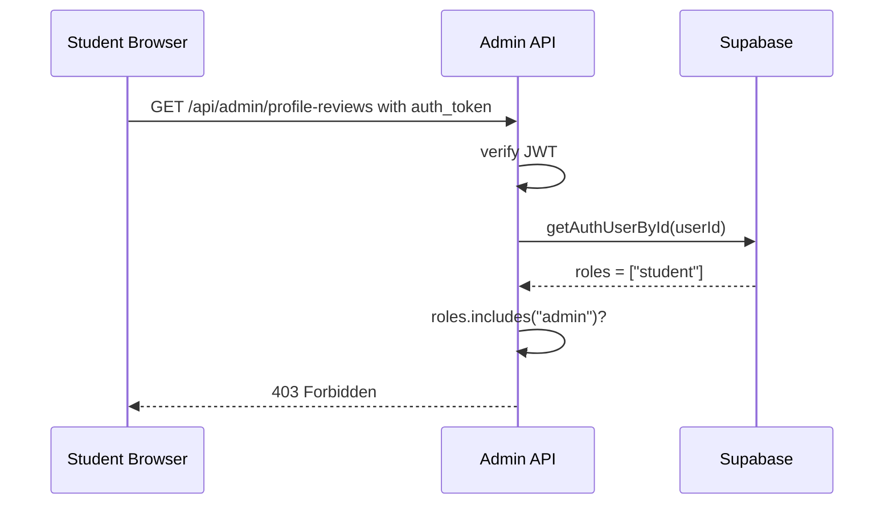

### 9.4. Endpoint khuyến nghị để demo

Dùng:

```text
GET /api/admin/profile-reviews?status=pending_review
```

Kết quả mong đợi:

| Trạng thái | Kết quả |
|---|---|
| Không đăng nhập | `401 Unauthorized` |
| Đăng nhập student | `403 Forbidden` |
| Đăng nhập admin | `200 OK` |

### 9.5. Demo bằng Browser Console

**Bước 1 - Đăng nhập tài khoản student**

Sau đó chạy:

```js
fetch('/api/admin/profile-reviews?status=pending_review', {
  credentials: 'include'
}).then(async (res) => ({
  status: res.status,
  body: await res.json()
})).then(console.log)
```

Kết quả mong đợi:

```text
status: 403
message: Forbidden
```

**Bước 2 - Đăng nhập tài khoản admin**

Chạy lại cùng lệnh.

Kết quả mong đợi:

```text
status: 200
success: true
```

### 9.6. Demo bằng PowerShell

Đăng nhập student:

```powershell
$BASE = "http://localhost:3000"
$StudentEmail = "student_demo@example.com"
$StudentPass = "StudentDemo123"

$studentSession = New-Object Microsoft.PowerShell.Commands.WebRequestSession
$studentBody = @{ email = $StudentEmail; password = $StudentPass } | ConvertTo-Json

Invoke-WebRequest `
  -Uri "$BASE/api/auth/login" `
  -Method POST `
  -Body $studentBody `
  -ContentType "application/json" `
  -WebSession $studentSession

Invoke-WebRequest `
  -Uri "$BASE/api/admin/profile-reviews?status=pending_review" `
  -WebSession $studentSession
```

Kết quả mong đợi:

```text
403 Forbidden
```

### 9.7. Lời trình bày ngắn

> JWT chỉ chứng minh người dùng đã đăng nhập. RBAC chứng minh người dùng có quyền hay không. Student có token hợp lệ nhưng không có role `admin`, nên API admin trả 403. Đây là khác biệt giữa authentication và authorization.

---

## 10. Kịch Bản 6 - Rate Limiting

### 10.1. Mục tiêu

Chứng minh hệ thống chống spam request đăng nhập bằng cách giới hạn số request theo IP trong một khoảng thời gian.

### 10.2. Implementation

File chính:

- `src/lib/rateLimit.ts`
- `src/app/api/auth/login/route.ts`
- `src/app/api/auth/register/route.ts`
- `src/lib/api-middleware.ts`

Cấu hình chính:

| Nhóm | Giới hạn |
|---|---|
| Login | 5 attempts / 1 phút |
| Register | 3 attempts / 10 phút |
| Forgot password | 3 attempts / 15 phút |
| Change password | 5 attempts / 1 phút |
| General API | 60 requests / 1 phút |
| Upload | 10 uploads / 1 phút |
| AI endpoint | 20 requests / 1 phút |
| Content creation | 5 creates / 1 phút |

Rate limiter hiện dùng in-memory `Map`.

Ý nghĩa khi thuyết trình:

> Cơ chế này phù hợp demo và single-instance server. Nếu triển khai production nhiều instance/serverless quy mô lớn, nên thay bằng Redis/Upstash để rate limit phân tán.

### 10.3. Sơ đồ hoạt động

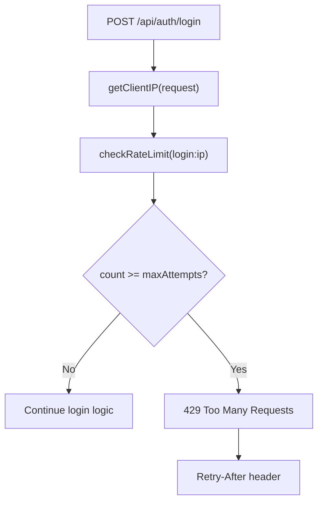

### 10.4. Demo an toàn

Để không khóa tài khoản thật, demo rate limiting bằng email không tồn tại.

```powershell
$BASE = "http://localhost:3000"

1..6 | ForEach-Object {
  $body = @{
    email = "not-exist-rate-demo@example.com"
    password = "WrongPass123"
  } | ConvertTo-Json

  try {
    $r = Invoke-WebRequest `
      -Uri "$BASE/api/auth/login" `
      -Method POST `
      -Body $body `
      -ContentType "application/json"

    "$_ => $($r.StatusCode)"
  } catch {
    "$_ => $($_.Exception.Response.StatusCode.value__)"
  }
}
```

Kết quả mong đợi:

```text
1 => 401
2 => 401
3 => 401
4 => 401
5 => 401
6 => 429
```

Có thể 429 xuất hiện sớm hơn nếu trước đó IP đã gọi login trong cùng 1 phút.

### 10.5. Lời trình bày ngắn

> Rate limiting bảo vệ endpoint đăng nhập khỏi brute-force và spam. Sau 5 lần trong 1 phút từ cùng IP, request tiếp theo bị trả 429 cùng `Retry-After`, yêu cầu client chờ trước khi thử lại.

---

## 11. Kịch Bản 7 - Account Lockout

### 11.1. Mục tiêu

Chứng minh một tài khoản cụ thể bị khóa tạm thời sau nhiều lần nhập sai mật khẩu.

Điểm khác với rate limiting:

| Cơ chế | Theo dõi theo | Mục đích |
|---|---|---|
| Rate limiting | IP/request key | Chống spam request |
| Account lockout | User account | Chống brute-force vào một tài khoản cụ thể |

### 11.2. Implementation

File chính:

- `src/app/api/auth/login/route.ts`

Hằng số chính:

```ts
MAX_FAILED_ATTEMPTS = 5
LOCKOUT_DURATION_MS = 15 * 60 * 1000
```

Cột database liên quan:

```text
users.failed_login_attempts
users.locked_until
```

Luồng:

1. User nhập sai mật khẩu.
2. Server tăng `failed_login_attempts`.
3. Nếu số lần sai >= 5, server set `locked_until = now + 15 phút`.
4. Trong thời gian khóa, login trả `423 Locked`.
5. Khi hết khóa, server reset `failed_login_attempts = 0`, `locked_until = null`.

### 11.3. Sơ đồ hoạt động

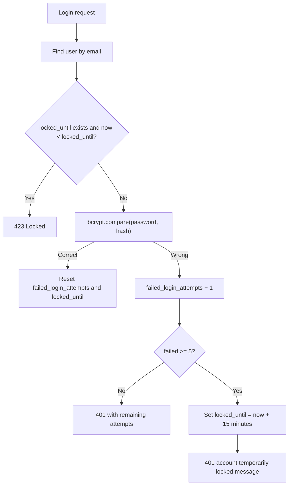

### 11.4. Demo khuyến nghị

Vì login cũng có rate limit theo IP, có 2 cách demo:

**Cách A - Dễ hiểu nhất bằng UI**

1. Dùng tài khoản demo có thể bị khóa.
2. Nhập sai mật khẩu 5 lần.
3. Quan sát message còn số lần thử.
4. Sau lần thứ 5, hệ thống báo tài khoản bị khóa 15 phút.
5. Chờ hết rate limit 1 phút, thử đăng nhập lại bằng mật khẩu đúng.
6. Kết quả mong đợi: `423 Locked` hoặc UI báo tài khoản tạm khóa.

**Cách B - Demo bằng PowerShell, tránh rate limit IP**

Dùng `X-Forwarded-For` khác nhau để không bị IP limiter chặn trước khi lockout.

```powershell
$BASE = "http://localhost:3000"
$Email = "student_lockout_demo@example.com"

1..5 | ForEach-Object {
  $body = @{
    email = $Email
    password = "WrongPass123"
  } | ConvertTo-Json

  try {
    $r = Invoke-WebRequest `
      -Uri "$BASE/api/auth/login" `
      -Method POST `
      -Body $body `
      -ContentType "application/json" `
      -Headers @{ "X-Forwarded-For" = "10.10.10.$_" }

    "$_ => $($r.StatusCode) $($r.Content)"
  } catch {
    "$_ => $($_.Exception.Response.StatusCode.value__)"
  }
}
```

Sau đó thử login bằng mật khẩu đúng nhưng IP khác:

```powershell
$body = @{
  email = $Email
  password = "StudentDemo123"
} | ConvertTo-Json

Invoke-WebRequest `
  -Uri "$BASE/api/auth/login" `
  -Method POST `
  -Body $body `
  -ContentType "application/json" `
  -Headers @{ "X-Forwarded-For" = "10.10.10.250" }
```

Kết quả mong đợi:

```text
423 Locked
Tài khoản tạm khóa...
```

### 11.5. Lời trình bày ngắn

> Rate limit bảo vệ endpoint theo IP, còn account lockout bảo vệ từng tài khoản. Nếu attacker đổi IP liên tục nhưng cố brute-force một email cụ thể, sau 5 lần sai tài khoản vẫn bị khóa tạm thời 15 phút.

---

## 12. Kịch Bản 8 - Recovery Keys Khi Đăng Ký

### 12.1. Mục tiêu

Chứng minh khi đăng ký, hệ thống tạo recovery keys để người dùng có thể khôi phục tài khoản nếu quên mật khẩu hoặc không truy cập được email.

### 12.2. Implementation

File chính:

- `src/app/api/auth/register/route.ts`
- `src/app/api/auth/recovery-key/verify/route.ts`
- `src/app/api/auth/recovery-key/list/route.ts`
- `src/app/api/auth/recovery-key/generate/route.ts`
- `src/components/RegisterModal.tsx`
- `src/components/RecoveryKeysModal.tsx`
- `src/components/ForgotPasswordModal.tsx`

Khi đăng ký:

1. Server tạo 16 recovery keys.
2. Mỗi key là 8 bytes random -> 16 ký tự hex uppercase.
3. Server hash key bằng SHA-256 kết hợp secret.
4. Server chỉ lưu hash trong `user_metadata`.
5. Plain recovery keys chỉ trả về đúng lúc tạo để người dùng lưu.
6. UI hiển thị modal cho phép copy/download.

Khi khôi phục:

1. User nhập email, recovery key, mật khẩu mới.
2. Server hash recovery key user nhập.
3. Server so sánh với hash đã lưu.
4. Nếu đúng, server xóa key đã dùng.
5. Server hash mật khẩu mới bằng bcrypt.
6. Server cập nhật password hash.

### 12.3. Sơ đồ đăng ký và lưu key

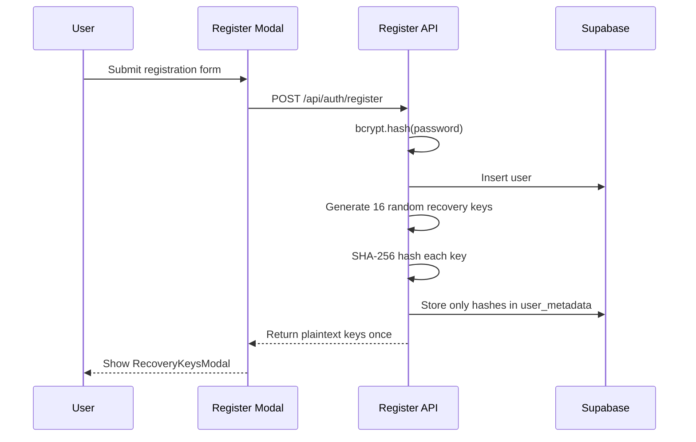

### 12.4. Sơ đồ dùng recovery key

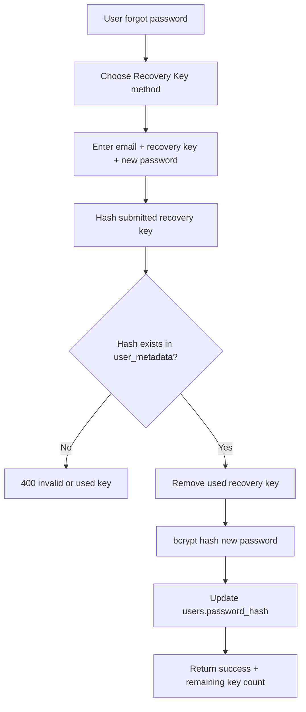

### 12.5. Demo bằng UI

**Bước 1 - Đăng ký tài khoản mới**

1. Mở form đăng ký.
2. Nhập email demo mới, ví dụ:

```text
recovery_demo_20260514@example.com
```

3. Nhập password hợp lệ: ít nhất 8 ký tự, có chữ hoa, chữ thường, số.
4. Submit.

Kết quả mong đợi:

- Đăng ký thành công.
- Modal `Recovery Keys của bạn` xuất hiện.
- Có 16 recovery keys.
- Có nút copy/download.

**Bước 2 - Chứng minh key chỉ hiện một lần**

1. Copy một recovery key để demo.
2. Đóng modal.
3. Nói rõ: hệ thống không lưu plain key, chỉ lưu hash nên về sau không thể xem lại toàn bộ key gốc.

**Bước 3 - Dùng recovery key để đổi mật khẩu**

1. Logout.
2. Mở `Quên mật khẩu`.
3. Chọn `Sử dụng Recovery Key`.
4. Nhập:

```text
Email: recovery_demo_20260514@example.com
Recovery Key: <key vừa copy>
Mật khẩu mới: NewPass456
```

5. Submit.

Kết quả mong đợi:

- Đổi mật khẩu thành công.
- Response hoặc UI báo còn lại số recovery keys.

**Bước 4 - Chứng minh key dùng một lần**

Lặp lại cùng recovery key.

Kết quả mong đợi:

```text
Recovery key không đúng hoặc đã được sử dụng
```

### 12.6. Demo bằng API

Sau khi đăng ký và có một key:

```powershell
$BASE = "http://localhost:3000"
$body = @{
  email = "recovery_demo_20260514@example.com"
  recoveryKey = "PASTE_RECOVERY_KEY_HERE"
  newPassword = "NewPass456"
} | ConvertTo-Json

Invoke-WebRequest `
  -Uri "$BASE/api/auth/recovery-key/verify" `
  -Method POST `
  -Body $body `
  -ContentType "application/json"
```

Kết quả mong đợi:

```text
success: true
remainingKeys: 15
```

### 12.7. Lời trình bày ngắn

> Recovery key hoạt động giống backup code. Server chỉ hiển thị key một lần khi tạo, còn database chỉ lưu hash. Mỗi key dùng một lần; sau khi khôi phục mật khẩu, key đó bị xóa để không thể tái sử dụng.

---

## 13. Kịch Bản 9 - bcrypt

### 13.1. Mục tiêu

Chứng minh mật khẩu không lưu plain text trong database, mà được hash bằng bcrypt với salt.

### 13.2. Implementation

File chính:

- `src/lib/auth.ts`
- `src/app/api/auth/register/route.ts`
- `src/app/api/auth/login/route.ts`
- `src/app/api/auth/change-password/route.ts`
- `src/app/api/auth/recovery-key/verify/route.ts`

Hàm chính:

```ts
hashPassword(password)
comparePassword(password, hash)
```

Cách hoạt động:

- Register: `hashPassword(password)` trước khi insert user.
- Login: `comparePassword(password, user.password_hash)`.
- Change password / recovery key reset: hash password mới trước khi update DB.
- Salt rounds: 12.

### 13.3. Sơ đồ hoạt động

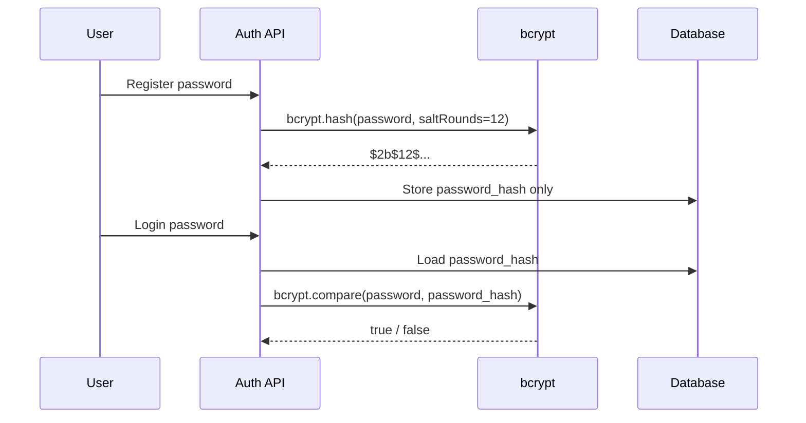

### 13.4. Demo bằng Supabase SQL

Không hiển thị toàn bộ hash của user thật trên slide. Chỉ cần chứng minh prefix và độ dài.

```sql
select
  email,
  left(password_hash, 7) as bcrypt_prefix,
  length(password_hash) as hash_length
from users
where email = 'student_demo@example.com';
```

Kết quả mong đợi:

```text
bcrypt_prefix = $2b$12$
hash_length   ~= 60
```

Giải thích:

- `$2b$` là format bcrypt.
- `12` là cost factor.
- Hash khác password gốc và không thể đảo ngược.

### 13.5. Demo bằng hành vi login

1. Đăng nhập với mật khẩu đúng -> `200 OK`.
2. Đăng nhập với mật khẩu sai -> `401`.
3. Nói rõ server không giải mã hash. Server dùng bcrypt compare để kiểm tra password nhập vào có khớp hash không.

### 13.6. Lời trình bày ngắn

> Mật khẩu không bao giờ lưu plain text. Khi đăng ký, server hash bằng bcrypt cost 12. Khi đăng nhập, server không giải mã mật khẩu mà dùng `bcrypt.compare`. Nếu database bị lộ, attacker không có mật khẩu gốc ngay lập tức.

---

## 14. Kịch Bản 10 - CORS Whitelist

### 14.1. Mục tiêu

Chứng minh browser chỉ cho JavaScript từ origin tin cậy đọc response API.

CORS không phải cơ chế xác thực. CORS là cơ chế browser enforcement để kiểm soát website nào được phép đọc response cross-origin.

### 14.2. Implementation

File chính:

- `src/middleware.ts`

Whitelist:

```text
https://dhvlearnx.page
https://www.dhvlearnx.page
http://localhost:3000
http://localhost:3001
NEXT_PUBLIC_MOBILE_APP_ORIGIN
```

Header được set:

```text
Access-Control-Allow-Origin
Access-Control-Allow-Methods
Access-Control-Allow-Headers
Access-Control-Allow-Credentials
Access-Control-Max-Age
```

Quan trọng:

- Trong `NODE_ENV=development`, code cho phép mọi origin để thuận tiện phát triển.
- Muốn demo whitelist blocking đúng nghĩa, nên demo trên production/deploy hoặc chạy môi trường production.

### 14.3. Sơ đồ hoạt động

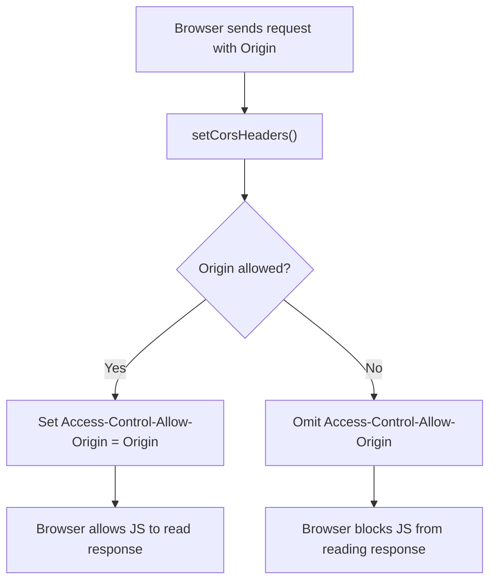

### 14.4. Demo bằng header inspection

Allowed origin:

```powershell
curl.exe -i `
  -H "Origin: https://dhvlearnx.page" `
  "https://dhvlearnx.page/api/auth/csrf"
```

Kết quả mong đợi:

```text
Access-Control-Allow-Origin: https://dhvlearnx.page
Access-Control-Allow-Credentials: true
```

Blocked origin:

```powershell
curl.exe -i `
  -H "Origin: https://evil.example" `
  "https://dhvlearnx.page/api/auth/csrf"
```

Kết quả mong đợi:

```text
Không có Access-Control-Allow-Origin: https://evil.example
```

Giải thích khi dùng `curl.exe`:

> `curl` không tự chặn CORS vì CORS là cơ chế của browser. Với `curl`, ta chỉ kiểm tra header. Browser mới là bên thực thi việc chặn JavaScript đọc response.

### 14.5. Lời trình bày ngắn

> Server không dùng wildcard `*` cho credential request. Nếu origin nằm trong whitelist, server echo lại origin đó. Nếu không, server bỏ header `Access-Control-Allow-Origin`, khiến browser chặn JavaScript từ origin lạ đọc response.

---

## 15. Thứ Tự Demo Khuyến Nghị Trong Buổi Báo Cáo

Thứ tự nên đi từ dễ thấy đến chuyên sâu:

1. **Security Headers**: mở DevTools Network, chứng minh header.
2. **JWT HTTP-only Cookie**: đăng nhập, mở Application Cookies và Console.
3. **Route Protection**: incognito vào `/learn`, bị redirect.
4. **CSRF Protection**: Console fetch thiếu token -> 403, có token -> 200.
5. **RBAC**: student gọi API admin -> 403, admin gọi -> 200.
6. **Rate Limiting**: loop 6 request login sai email không tồn tại -> 429.
7. **Account Lockout**: dùng account demo nhập sai 5 lần -> khóa 15 phút.
8. **Recovery Keys**: đăng ký account mới, thấy 16 keys, dùng 1 key để reset.
9. **bcrypt**: mở DB query prefix `$2b$12$`.
10. **CORS Whitelist**: giải thích production header allow/block origin.

Lý do thứ tự này hiệu quả:

- 3 demo đầu dễ nhìn, tạo nền về browser/session.
- CSRF/RBAC cần người nghe đã hiểu cookie/JWT.
- Rate limiting và lockout dễ bị nhầm, nên đặt cạnh nhau để so sánh.
- Recovery keys và bcrypt kết thúc bằng phần xác thực tài khoản chuyên sâu.

---

## 16. Checklist Nhanh Trước Khi Lên Trình Bày

### 16.1. Checklist kỹ thuật

- [ ] App chạy tại `http://localhost:3000`.
- [ ] Có tài khoản student demo.
- [ ] Có tài khoản admin demo.
- [ ] Biết password đúng của tài khoản demo.
- [ ] Có account riêng để demo lockout.
- [ ] DevTools mở được tab `Network`, `Application`, `Console`.
- [ ] Đã chờ hết rate limit nếu vừa test login nhiều lần.
- [ ] Không dùng `/api/admin/stats` làm bằng chứng RBAC.
- [ ] Không dùng login/register làm bằng chứng CSRF.
- [ ] Nếu demo CORS whitelist, dùng production/deploy hoặc giải thích local dev đang allow all origin.

### 16.2. Checklist bằng chứng cần chụp

| Kịch bản | Bằng chứng nên chụp |
|---|---|
| Security Headers | Response Headers trong Network |
| HTTP-only Cookie | Cookie `auth_token` có HttpOnly, Console không đọc được |
| CSRF | Response 403 khi thiếu `X-CSRF-Token` |
| Route Protection | Redirect `/learn` -> `/auth/login` |
| RBAC | Student nhận 403 khi gọi API admin |
| Rate Limiting | Request thứ 6 nhận 429 + `Retry-After` |
| Account Lockout | Login bị khóa với status/message lock |
| Recovery Keys | Modal 16 keys, key dùng một lần |
| bcrypt | DB chỉ có `$2b$12$...`, không có plain password |
| CORS | Origin lạ không được trả `Access-Control-Allow-Origin` |

---

## 17. Các Câu Hỏi Hội Đồng Có Thể Hỏi

### 17.1. Vì sao JWT để trong cookie mà vẫn cần CSRF?

Vì cookie được browser tự động gửi theo request. Nếu attacker lừa user bấm vào một trang độc hại, browser vẫn có thể gửi request kèm cookie đến website thật. CSRF token bắt buộc request thay đổi dữ liệu phải có thêm một giá trị mà attacker không biết để đặt vào custom header.

### 17.2. Vì sao `csrf_token` không HTTP-only?

Vì client JavaScript chính chủ cần đọc token này để gửi `X-CSRF-Token`. Token này không phải token đăng nhập. Nếu lộ CSRF token nhưng không có `auth_token` HTTP-only và cùng browser context, attacker vẫn khó giả mạo session.

### 17.3. Vì sao login/register được miễn CSRF?

Vì trước khi login/register, user chưa có session bảo vệ. Login/register là endpoint khởi tạo phiên. CSRF chủ yếu bảo vệ request thay đổi dữ liệu trong ngữ cảnh đã đăng nhập bằng cookie.

### 17.4. Rate limiting và account lockout khác nhau thế nào?

Rate limiting giới hạn tần suất request theo IP/key trong thời gian ngắn. Account lockout khóa một tài khoản cụ thể sau nhiều lần nhập sai, kể cả attacker đổi IP.

### 17.5. CORS có thay thế authentication không?

Không. CORS chỉ quyết định browser có cho JavaScript cross-origin đọc response hay không. API vẫn phải kiểm tra JWT, CSRF và role.

### 17.6. Nếu database lộ thì recovery key có bị lộ không?

Database lưu hash của recovery key, không lưu plain key. Attacker không có key gốc ngay lập tức. Tuy nhiên key chỉ dài 16 hex ký tự, nên cần bảo vệ secret và database nghiêm túc; trong production có thể cân nhắc tăng entropy/độ dài key.

### 17.7. Rate limiter in-memory có đủ cho production không?

Đủ để demo và single-instance. Với serverless hoặc multi-instance, mỗi instance có memory riêng nên nên chuyển sang Redis/Upstash để đồng bộ rate limit toàn hệ thống.

---

## 18. Tóm Tắt Một Câu Cho Từng Cơ Chế

| Cơ chế | Một câu dễ nhớ |
|---|---|
| Security Headers | Browser nhận chỉ dẫn bảo mật ngay từ response đầu tiên |
| HTTP-only JWT Cookie | Token đăng nhập được browser giữ nhưng JavaScript không đọc được |
| CSRF | Request đổi dữ liệu phải chứng minh nó đến từ UI chính chủ bằng `X-CSRF-Token` |
| Route Protection | Không có token thì không vào được route cần đăng nhập |
| RBAC | Có đăng nhập chưa đủ, phải có đúng vai trò |
| Rate Limiting | Một IP spam login quá nhanh sẽ bị 429 |
| Account Lockout | Một tài khoản bị nhập sai quá nhiều sẽ bị khóa tạm thời |
| Recovery Keys | User có backup code dùng một lần để khôi phục tài khoản |
| bcrypt | Database chỉ lưu hash có salt, không lưu mật khẩu gốc |
| CORS | Browser chỉ cho origin tin cậy đọc response cross-origin |

---

## 19. Kết Luận Khi Trình Bày

Thông điệp tổng kết nên nhấn mạnh:

> Hệ thống áp dụng defense-in-depth. Không có lớp nào được xem là đủ một mình: cookie HTTP-only giảm rủi ro đánh cắp token, CSRF chặn request giả mạo qua cookie, route protection chặn user chưa đăng nhập, RBAC chặn user sai vai trò, rate limit và lockout giảm brute-force, bcrypt bảo vệ mật khẩu trong database, recovery keys hỗ trợ khôi phục tài khoản, còn security headers và CORS giảm rủi ro từ browser/cross-origin.

Nếu hội đồng hỏi về giới hạn:

> Một số cơ chế hiện phù hợp demo/single-instance, ví dụ rate limiting in-memory. Khi scale production, em sẽ nâng cấp sang Redis-based rate limiting và rà soát thống nhất RBAC cho toàn bộ `/api/admin/*`.

